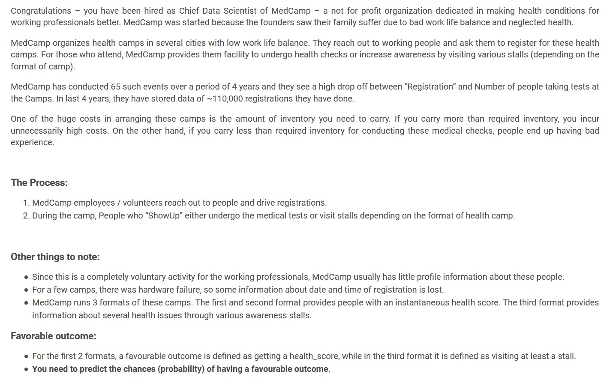
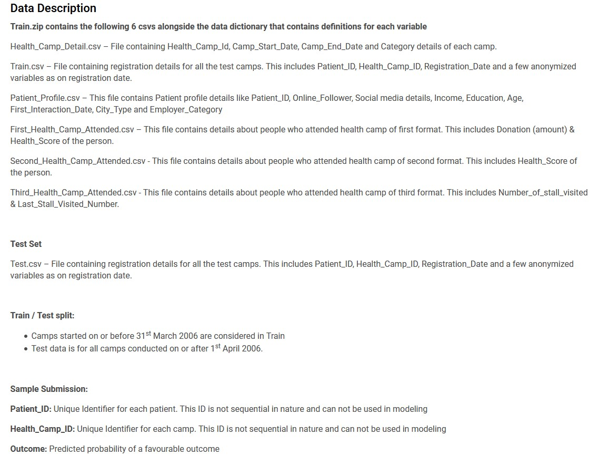
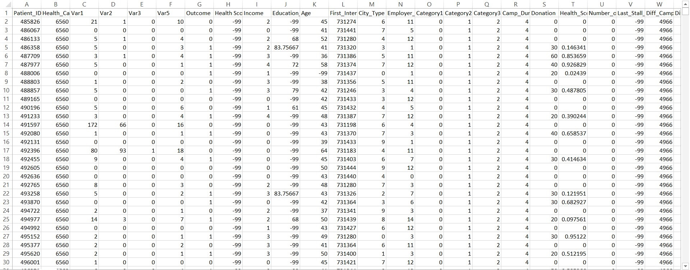
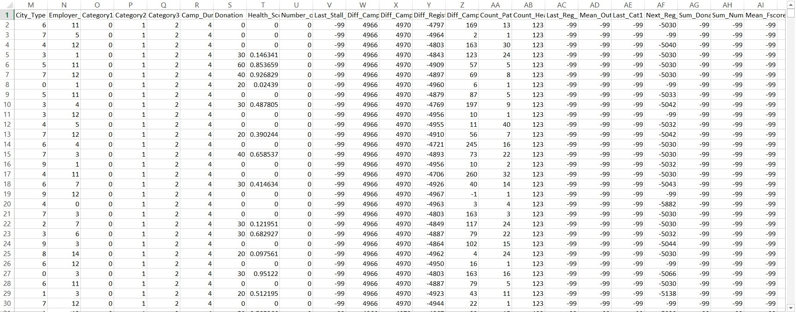

# Analytics Vidhya Jantahack Healthcare Analytics

Public Leaderboard Rank: 12
 
Private Leaderboard Rank: 4

## Problem Statement

## Data Description at a Glance:

## Data after Merging and Feature Engineering:

## Description of Approach/Feature Engineering:
1. Created training dataset with outcome column merged with all the camp details.
2. Merged new train dataset and patient dataset to form new train and test dataset
3. Created the train, test dataset with date difference features and also applied encoding on categorical data
4. Created Frequency related features

## Tools used
1. Python
2. pandas and numpy libraries for data manipulation
3. sklearn's preprocessing and metrics for evaluating classification models preformance
4. xgboost for gradient boosting

## Score
The score obtained using this solution is **0.8398043541**

## Credits:
This hackathon is repeated after 4 years... also solutions were provided by the previous participants which I referred. \
[Knocktober 2016](https://datahack.analyticsvidhya.com/contest/knocktober-2016/)

## Competition Result
[Rank](https://datahack.analyticsvidhya.com/contest/janatahack-healthcare-analytics/#LeaderBoard): 12th on public LB and 4th on private LB
